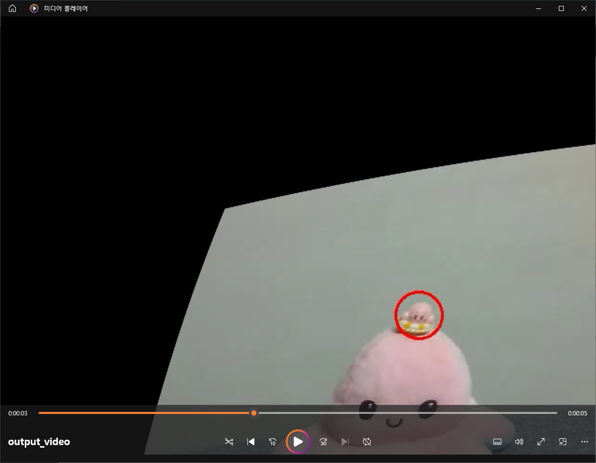

# Camera Pose Estimation and AR

 

내 카메라를 캘리브레이션하고 간단한 AR 기법을 응용.

 

이전의 카메라 영상과 이전의 Calibration 결과(즉, parameter)를 사용함.

 

 

### 영상을 Calibration하고, AR을 추가한 결과

인형 위의 피규어에 빨간 동그라미를 표시함.

 

 

### 프로그램 간략 설명

calibration.py 파일로 필요한 parameter 값을 받아왔다.

그리고 그 값을 estimation.py를 통해 영상을 출력하고, 그 위에 AR(빨간 동그라미)를 추가했다.